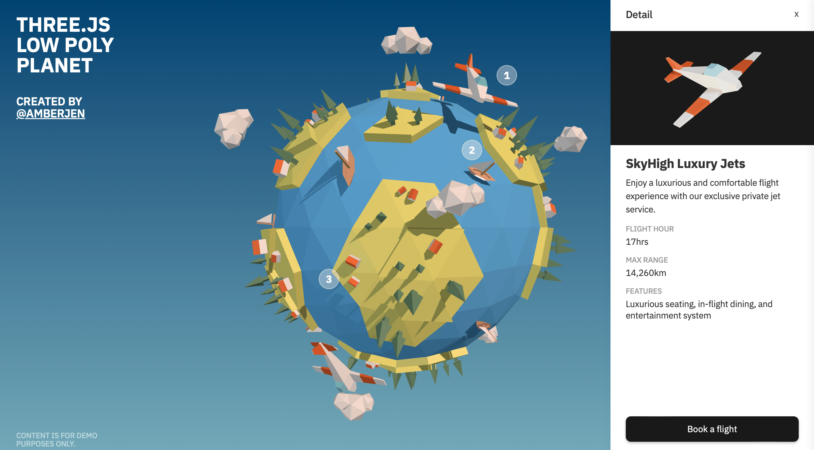

# Learn Three.js

## 01 Solar System

**Resources**
  - [Solar Textures](https://www.solarsystemscope.com/textures/)
  - [HDRI to CubeMap](https://matheowis.github.io/HDRI-to-CubeMap/) 

**References**
  - Solar System repositories from [WaelYasmina](https://github.com/WaelYasmina/solarsystem/) and [iamshvetsov](https://github.com/iamshvetsov/solar-system/)
  - [Solar System](https://en.wikipedia.org/wiki/Solar_System) (Wikipedia)
  

## 02 3D Text

**Resources**
  - [Facetype.js](https://gero3.github.io/facetype.js/)
  - [Matcap PNG Textures](https://github.com/nidorx/matcaps)

## 03 Haunted House

- Models built using Three.js geometry

**Resources**
  - [Poly Heaven](https://polyhaven.com/)
  - [3D Textures](https://3dtextures.me/)
  - [WebP](https://formulae.brew.sh/formula/webp)

## 04 Galaxy Generator

## 05 Scroll Animation

## 06 Interactive Low Poly Planet

- Model created using Blender (inspired by Polygon Runway)
- Live demo: https://lowpoly-planet.vercel.app/